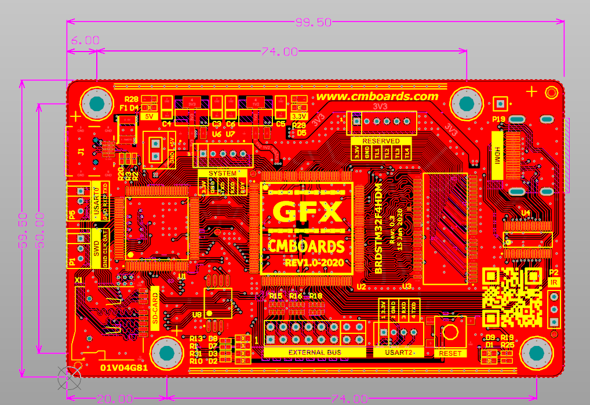
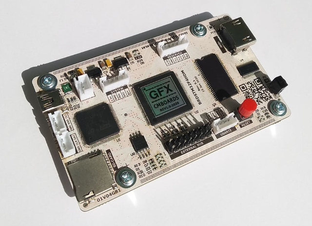
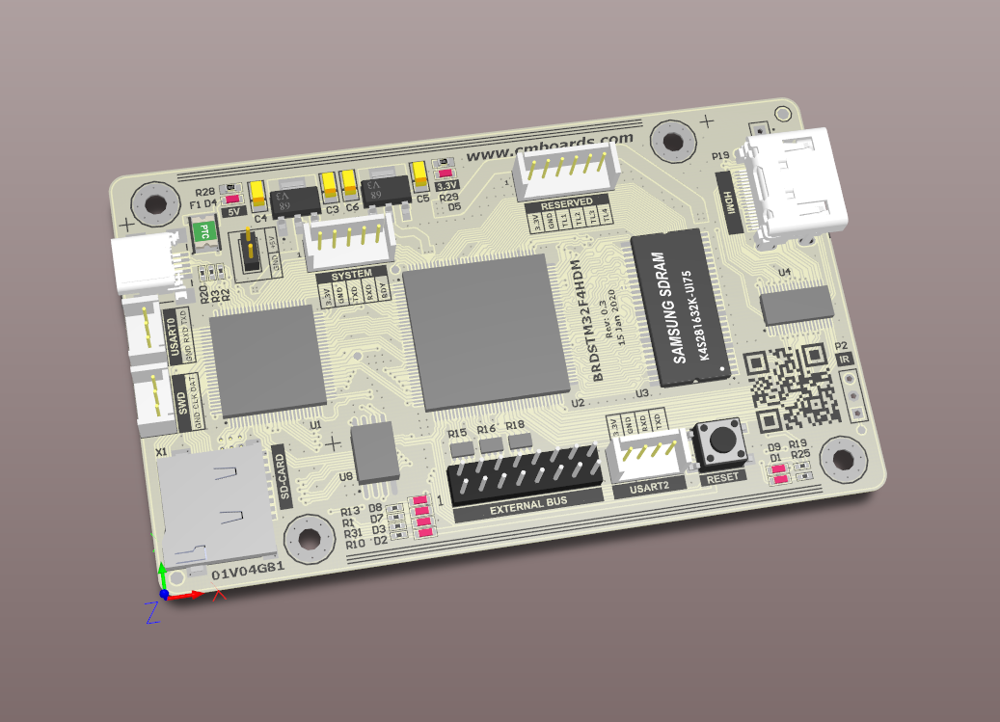
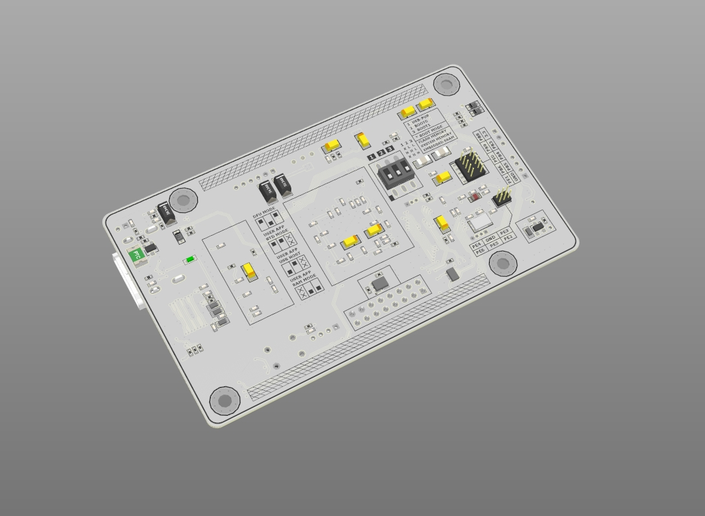

# BRD32F407HDMIR3 Board

Embedded development board combining an ARM MCU and FPGA with HDMI output capability.

---

## Key Features

- **MCU:** STM32F407 (ARM Cortex-M4)
- **FPGA:** Xilinx XC6SLX9 (Spartan-6)
- **Video Output:** HDMI
- **Storage:** SD Card Interface

---

## Overview

The **BRD32F407HDMIR3** board is designed for projects requiring tight integration between a microcontroller and FPGA fabric, with direct HDMI video output capability.  

Typical use cases include:

- Video signal generation and processing  
- Retro computing / graphics experiments  
- Embedded UI systems  
- FPGA + MCU co-processing tasks  

---

**PCB Layout / Top Layer**

**Assembled Device**

**3D Model Top View**

**3D Model Bottom View**

---

## Notes

- HDMI output is handled via FPGA logic  
- STM32F407 is responsible for control, data preparation, and peripherals  
- Suitable for custom video pipelines and hardware acceleration experiments  

---

2020 Viktor Glebov (V01G04A81)