### electro-lviv.com 2013-2015 / PCB Gerber Visualization Project

 

| Property          | Value                       |
|-------------------|-----------------------------|
| Started on        | Apr 2013                    |
| First published   | Nov 2013 (Demo)             |
| Stable version    | Jun 2014                    |
| Author            | Viktor Glebov (V01G04A81)   |
| Language          | PHP / JavaScripts           |

 

#### Gerber (RS-274X) and Excellon Parsing Libraries

The implementation supports basic interpretation of PCB manufacturing data, including:
- Aperture definitions and drawing primitives (Gerber)
- Coordinate parsing and tool handling (Excellon)
- Layer data extraction for further visualization or analysis
- Preprocessing for pseudo-3D rendering and web-based viewers

These libraries were developed as part of a web-based PCB visualization and analysis toolchain.

This repository contains PHP and JavaScript libraries for parsing and processing Gerber (RS-274X) and Excellon (drill) files.

- [View source code](https://github.com/vigatron/vigatron.github.io/tree/main/projects/elviv2012/src_gcode_part/)

  

<table>
  <tr>
    <td align="center">
      <a href="pics_web/pcb3dvis.png">
        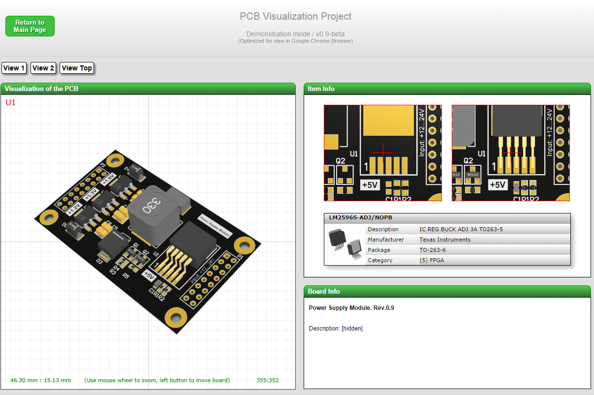 
        <b>PCB 3D Visualization</b>
      </a>
    </td>
    <td align="center">
      <a href="pics_web/icsdb.png">
        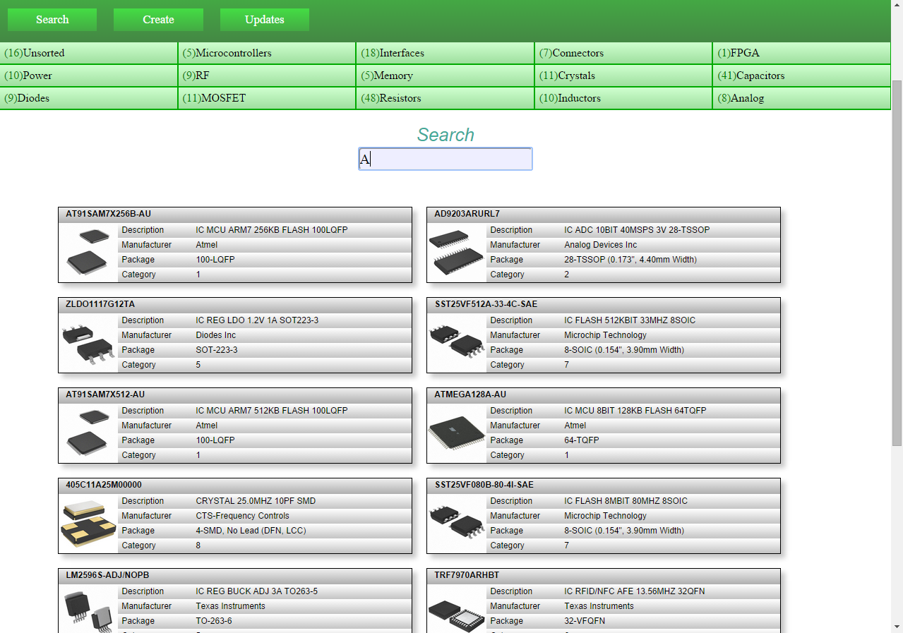 
        <b>BOM Manager</b>
      </a>
    </td>
  </tr>
</table>

<table>
  <tr>
    <td align="center">
      <a href="pics_web/gcode1.png">
        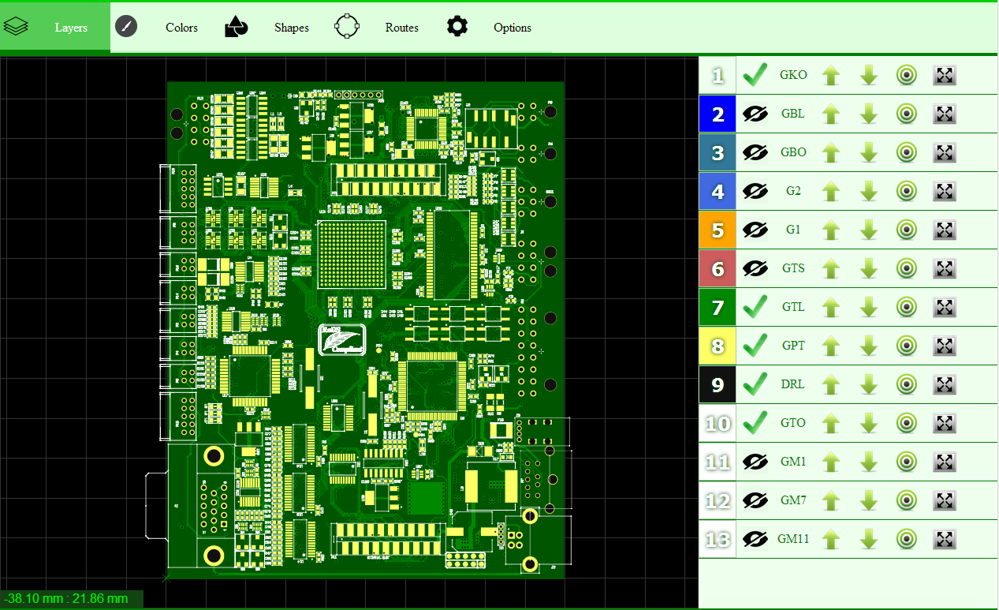 
        <b>Gerber Files Viewer</b>
      </a>
    </td>
    <td align="center">
      <a href="pics_web/gcode2.png">
        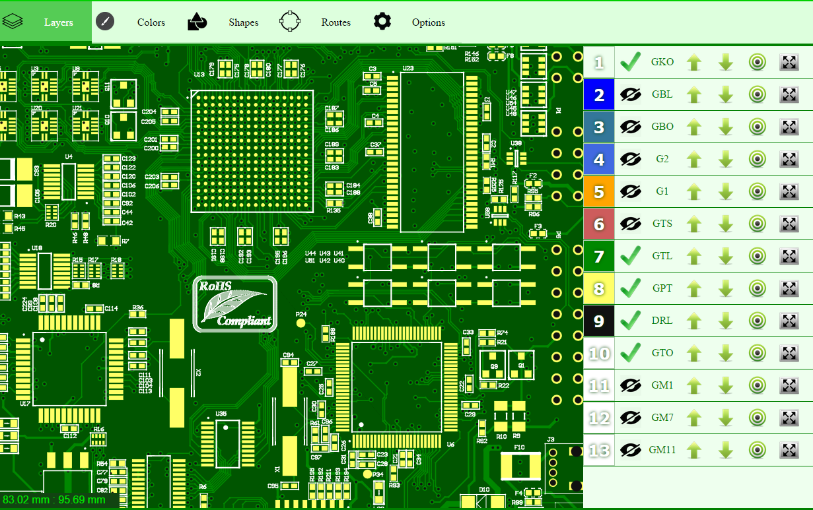 
        <b>Gerber Files Viewer (Zoom)</b>
      </a>
    </td>
  </tr>
</table>

  

---

### AT91Giga Board ( Own project )

| Property          | Value                       |
|-------------------|-----------------------------|
| Started on        | Aug 2013                    |
| Author            | Viktor Glebov (V01G04A81)   |

#### Multi-Architecture Emulator Board

 

  <a href="pics/armmcugiga.png">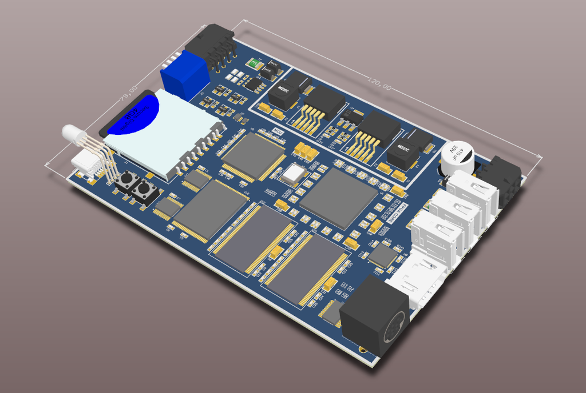</a> 
  <em>AT91Giga Board : Year: 2012-2013 </em>

 

&bull; <b>Hardware Stack:</b> ARM 32-bit MCU + FPGA + HDMI Output + SD Card Storage.

&bull; <b>Emulation Targets:</b> 
<ul>
    <li><b>Planned Support:</b> Designed for emulation of <b>x86</b>, <b>MOS 6502</b>, <b>Zilog Z80</b>, and <b>ATmega</b> architectures.</li>
    <li><b>Current Implementation:</b> Partial emulation achieved for <b>x86</b> and <b>ATmega</b> cores.</li>
</ul>

&bull; <b>Technical Progress:</b> 
<ul>
    <li><b>x86 Core:</b> Instruction set is partially implemented; currently developing <b>IRQ handling</b> and system timers.</li>
    <li><b>Status:</b> Project is temporarily <b>on hold</b> due to workload and priority tasks.</li>
    <li><b>Future Goals:</b> Achieving stable BIOS POST and basic DOS compatibility.</li>
</ul>

 

---

  

## Diesel Motor Controller (HOPA Motortuning GmbH / Optimex Import Export GmbH)

| Property          | Value                       |
|-------------------|-----------------------------|
| Started on        | Dec 2013                    |
| Gerbers Completed | Feb 2014                    |
| Tests             | May 2014 / Aug 2015         |
| PCB Layout        | Viktor Glebov (V01G04A81)   |

 

&bull; PCB layout design  
&bull; Production Test Software & QA  

 

<b>High-Voltage Piezo Injector Control</b>

The system supports high-voltage piezoelectric fuel injector control in the 100V to 200V range.

 

    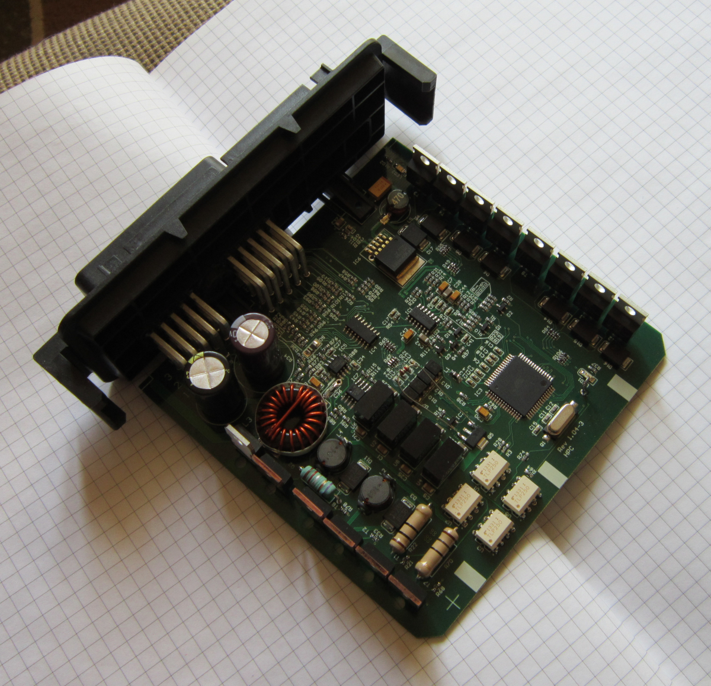
    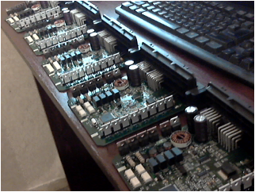 

 

> Unlike conventional solenoid injectors, piezo injectors require a fast high-voltage charge and discharge cycle to actuate the piezo stack with extremely low response time and high injection precision.

 

The driver architecture consists of:

* a high-voltage DC-DC boost converter,
* fast charge/discharge switching stage,
* energy recovery circuit,
* and protected high-speed gate driver circuitry.

 

The piezo actuator behaves mainly as a capacitive load, therefore the control strategy is based on controlled energy transfer rather than continuous current drive.

Typical operation sequence:

1. The boost converter generates the required high-voltage rail (100V–200V).
2. The injector is charged with a fast high-current pulse.
3. The piezo stack expands and opens the injector valve.
4. After the injection event, the stored energy is actively discharged or recovered back into the power stage.

 

Special design considerations include:

* fast switching edge control,
* high peak transient currents,
* EMC/EMI suppression,
* overvoltage protection,
* thermal stability,
* and safe handling of inductive and capacitive transients.

 

The firmware controls:

* injection timing,
* pulse width,
* charge/discharge profile,
* and multi-stage injection sequences for precise fuel delivery at high engine RPM.

The hardware design is suitable for modern high-speed automotive piezo injector systems used in common rail diesel and direct injection engines.

  

---

  

## GPS Tracker (Taxi / Dubai)

| Property           | Value                       |
|--------------------|-----------------------------|
| Started on         | Sep 2014                    |
| Gerbers Completed  | Oct 2014                    |
| Embedded Software  | Feb 2015                    |
| GUI Tools & Config | Mar 2015                    |
| Tests on           | Apr 2015                    |
| Author 1           | V01G04A81                   |
| Author 2           | Sprk81                      |

 

&bull; Designed full hardware platform (STM32 + SD + audio subsystem)  
&bull; Integrated MP3/FM functionality (client requirement)  
&bull; Developed PC-side configuration tool (USB)  

 

> Basically, this is a bare-bones, compact version of the 2008 AutoNavi module stripped down for baseline tasks.
(https://vigatron.github.io/projects/autonavi2008/)
It features support for 2 independent stereo channels for simultaneous audio streaming.

> What's been removed:
> * Video card / video interface
> * Dispatch and routing systems
> * Passenger counters and cabin image capture
> * All other driver tracking and route-logging systems
> 
> What's kept:
> * Kernel + FreeRTOS + Debug protocols
> * GPS NMEA Parser + Serial protocols
> * USB Serial Port for configuration & testing
> * Audio module / MP3 library / MP3 playback
> * File system / FatFS / SD-Card / Embedded Serial 16-Mbytes FLASH
> 
> What's added:
> * FM module / Voice message audio transmitter
> * 3-Axis accelerometer
> * Sonar / LiDAR support for distance ranging

#### Hardware
* STM32F407
* SD-Card Interface / SPI
* UDA1334 / I2S
* FM Transmitter / I2S
* Serial Flash 16Mb
* USART / GPS
* USB Interface ( STM32-based )

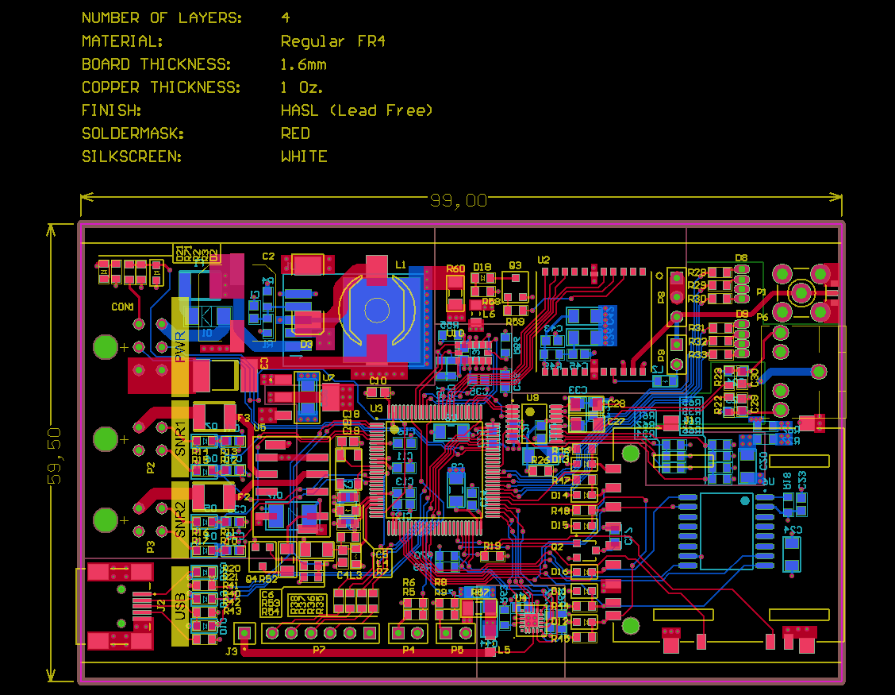 
PCB Layout / Gerber Viewer

  

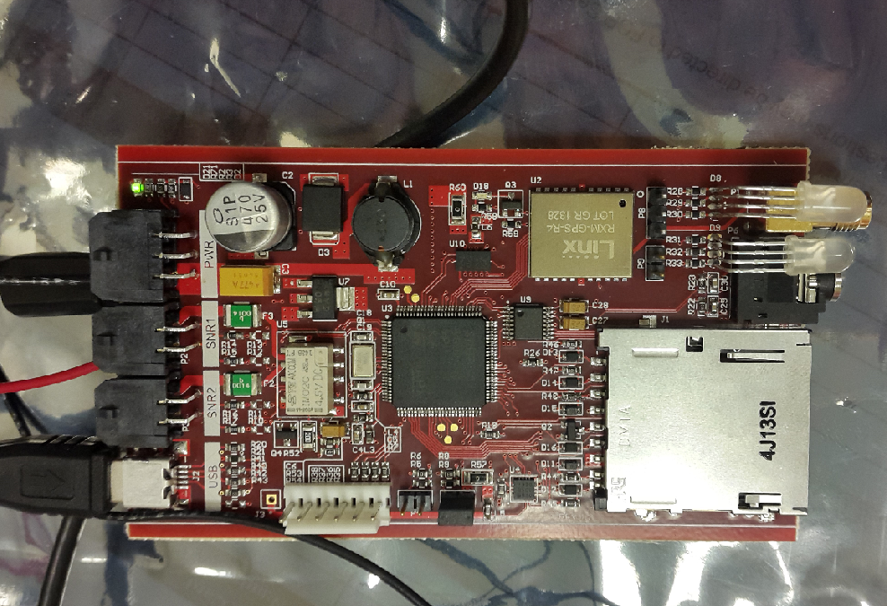 
Assembled Board

  

#### Software
* FreeRTOS
* MP3 Decoder Library
* FatFs library
* USB device interface
* GPS / NMEA message Parser / USART
* SD Card & SPI Serial Flash drivers

#### Configuration tool

* GUI / Microsoft C# 
* System Diagnostic & Configuration
* Upload MP3 files via USB Interface
* Download GPS binary data blocks

---

  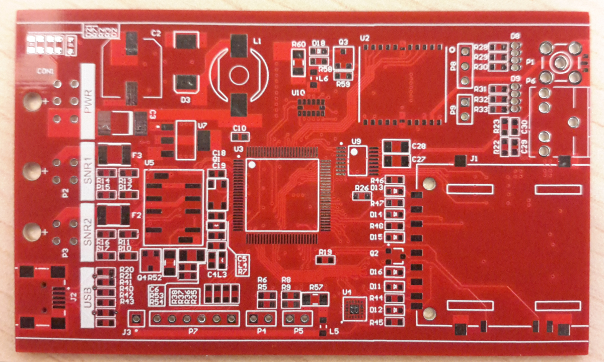
  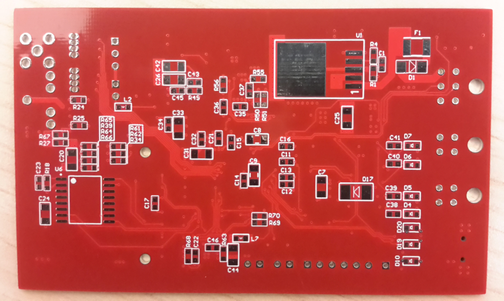

  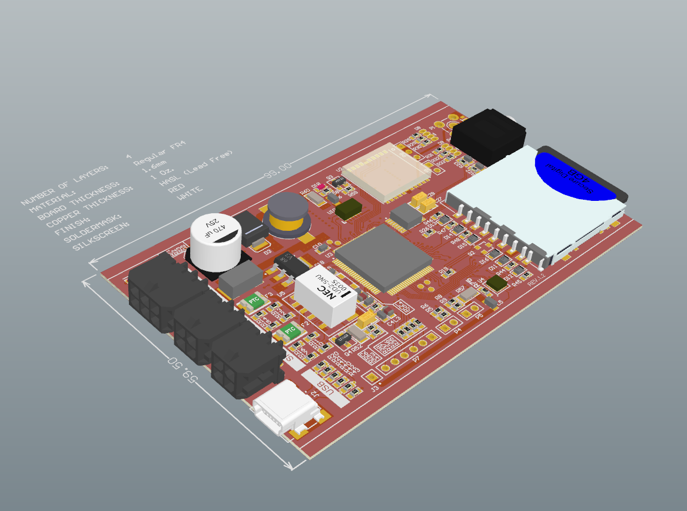
  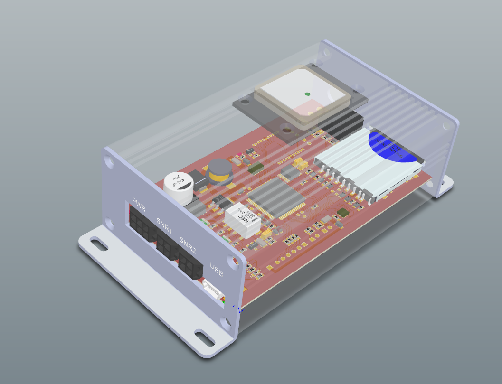

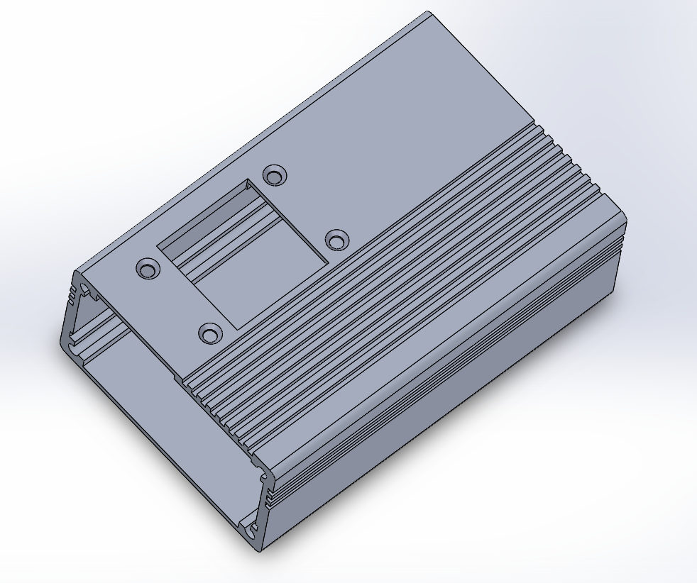
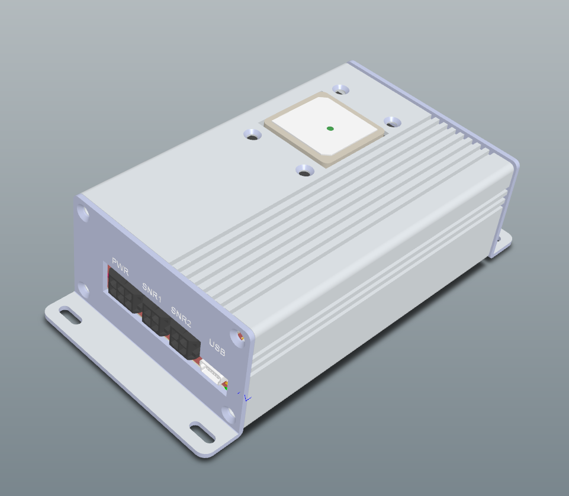

  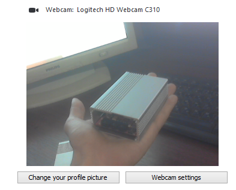
  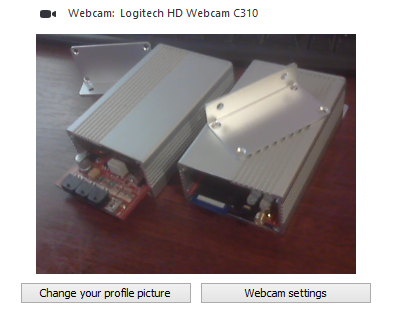

 

> When we tried to ship the prototype devices directly to Dubai via DHL, customs blocked the package.
They thought the device looked like a tracking bug that could be used to spy on people and send location coordinates over radio.
In reality, it was nothing like that — it was just a low-power voice transmitter with a maximum of 2 mW (normally running at 1 mW). That’s enough to send voice messages about 30–50 meters away. Since the first prototypes were stuck in Ukraine and we had an event/presentation coming up in the UAE, we decided to manufacture the whole batch outside Ukraine. We made them in Canada and China through our partner KS Circuits Inc, and then did all the firmware development, testing, and debugging remotely.

> In the end, everything worked great, and devices were successfully showcased at the "RTA Back Off Radio 2015" in Dubai.
https://www.youtube.com/watch?v=7nTjF7D036w

---

## DGPS Module NEO-7P

| Property                      | Value                       |
|-------------------------------|-----------------------------|
| Started on                    | Dec 2014                    |
| Prototypes assembled          | Mar 2015                    |
| Successfully tested           | Apr 2015                    |

 

<b>NEO-7P GPS module </b>  
Development and selection of the passive antenna circuit configuration (LNA amplifier, SAW filter, GPS Patch antenna).

<b>Enhanced technical description for the project</b>
u-blox NEO-7P is a high-precision GNSS module from the u-blox 7 series (now EOL, succeeded by newer modules like NEO-F9P).  
It supports Precise Point Positioning (PPP) and Differential GPS (DGPS) for accuracy better than 1 meter.

<b>Key features and specifications</b>

+ GNSS support: GPS L1 C/A, GLONASS L1 FDMA, QZSS L1 C/A, SBAS (WAAS, EGNOS, MSAS).
+ Position accuracy:
    * Standalone GPS: ~2.5 m CEP.
    * With SBAS: ~2.0 m CEP.
    * With SBAS + PPP: < 1 m CEP.
+ Sensitivity: Up to -161 dBm (tracking).
+ Time to First Fix (TTFF): Cold start ~30 s, aided ~5 s, reacquisition ~1 s.
+ Channels: 56-channel u-blox 7 engine.

##### 3D Models & PCB

<table>
  <tr>
    <td>
    
    </td>
    <td>
    
    </td>
    <td>
    
    </td>
    <td>
    
    </td>
  </tr>
</table>

+ PCB manufactoring: ДП ГАЛЬВАНОТЕХНIКА / 3 weeks / x2 prototypes
[viktor_glebov_quittance_2xPCBPlug7.pdf](docs_dgps/viktor_glebov_quittance_2xPCBPlug7.pdf)
 
+ Parts Lists:  [Рахунок_9329.rtf](docs_dgps/Рахунок_9329.rtf)
    * SAW RF FILTER 1575.42 MHZ
    * IC AMP MMIC RF LNA 20DB TSLP-6
    * IC AMP LOW NOISE 6-UDFN

---

## Stereo Camera (own project)

| Property                      | Value                       |
|-------------------------------|-----------------------------|
| Started on                    | Aug 2014                    |
| Partial Emulation Done        | Jan - Apr 2015              |
| Hardware Design Lite + Base   | Aug 2015                    |
| Hardware Design XXL version   | May 2016                    |
| Author                        | Viktor Glebov (V01G04A81)   |

 

&bull; Designed system architecture: STM32 + FPGA + SDRAM  
&bull; Dual synchronized camera interface  
&bull; HDMI output + WiFi module integration  

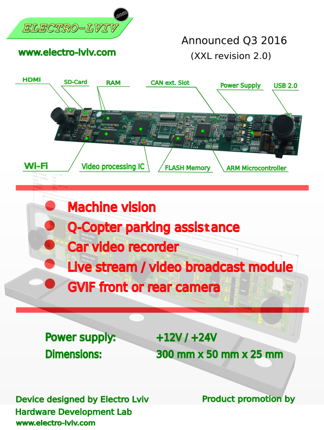

#### Hardware

<table>
    <thead>
      <tr>
        <th>Mini Version Draft 2013</th>
        <th>Base Version 2014</th>
        <th>XXL Version  2015</th>
      </tr>
    </thead>
<tr>
<td></td>
<td></td>
<td></td>
</tr>
<tr>
<td></td>
<td valign="top">
<b>Base Version</b> 
&bull; STM32F407 
&bull; XC6SLX9 
&bull; MT48LC16M16A2P-75 x2 
&bull; USB Interface 
</td>
<td>
<b>XXL Version</b> 
&bull; STM32F746 
&bull; XC6SLX16 
&bull; MT48LC16M16A2P-6A x2 
&bull; HDMI Output 
&bull; Micro SD-Card 
&bull; USB Interface 
</td>
</tr>
</table>

#### Software

&bull; Embedded C/C++
&bull; FreeRTOS  
&bull; VHDL / Verilog + Testbenches  

#### Key Functionalities

&bull; <b>Traffic Sign Recognition (TSR):</b> Real-time detection and classification of road signs.  
&bull; <b>Spatial Estimation:</b> High-precision distance measurement to obstacles using stereo-vision disparity maps.  
&bull; <b>Lane Detection & Classification:</b> Identification of road markings and lane boundary types.  

 

#### Example

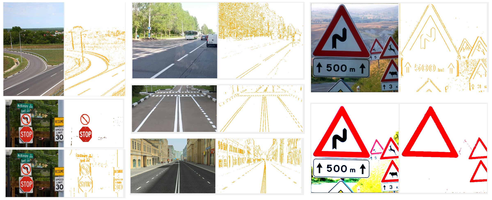

  

---

  

## 3-Axis CNC Controller | Proprietary High-Performance Platform

| Property                               | Value                 |
|----------------------------------------|-----------------------|
| Start Date                             | Feb 2015              |
| PCB Design Done                        | Apr 2015              |
| Engrave Software Draft (v1 Beta)       | Jul 2015              |
| Bootloader Draft (v1 Beta)             | Dec 2015              |
| Engrave Software v2 Demo / trade show  | Feb 2016              |
| Engrave Software v2 Stable             | - / unfinished        |
| CNC Software                           | - / unfinished        |
| Server / Client software               | - / unfinished        |

**Contributors:**
- **V01G04A81** — system architecture, hardware design, embedded software development  
- **Sprk81** — hardware abstraction layer (HAL) design, low-level drivers (initial implementation)  
- **GMad** — sensors integration, mechanical system consulting  

<i><b>
Full-cycle hardware/firmware development of a multifunctional CNC controller with a custom "Engrave Version" option for client use.</b></i>  

&bull; <b>System Ownership</b> Independently developed a proprietary motion control architecture (STM32 + FPGA + L6472).  

&bull; <b>Custom Implementation</b> Engineered a specialized "Engrave Version" tailored to specific client requirements for precision engraving.  

&bull; <b>Architectural Innovation</b>
+ Transitioned from legacy AVR systems to a high-speed hybrid processing model (proposed Feb 2015).
+ Leveraged FPGA for hardware-level pulse generation to ensure zero-jitter motion control.

&bull; <b>Design Standards</b>
Developed based on STMicroelectronics and Avnet industrial reference designs, ensuring robust EMI/EMC performance.

Retained full IP rights for the core hardware architecture while delivering a licensed functional module for the client's engraving equipment.

  
<table>
<tr><td valign="top"><b>Hardware</b> 
&bull; STM32F407 
&bull; XC6SLX9 
&bull; MT48LC16M16A2P-75 
&bull; L6472 x3 
&bull; Extension I/O port 
</td>
<td><b>Software</b> 
&bull; FreeRTOS 
&bull; App core 
&bull; STM32 peripheral drivers 
&bull; L6472 drivers 
&bull; VHGUI2016 @ 800x480 port (over SPI, draft) 
&bull; Verilog / Testbenches 
</td>
</tr>
</table>
  
&bull; <b>Status</b>
Gerbers Sent to production 13 Apr 2015  
Manufacturer: BYSCO TECHNOLOGY LIMITED  
Quotation: [The quotation of DraftStanok1 on 13 April 2015](docs_stk/ThequotationofDraftStanok1on13thApril2015.pdf)
Gerbers: [Gerber Files - TOP Layer, Top Silk Layer, KeepOut Layer](docs_stk/stanok1_gerbers_partially_13apr2015.zip)
  
  
> PCB Gerber files authored and submitted to production by V01G04A81 (Apr 2015).  
> A manufacturer quotation (BYSCO TECHNOLOGY LIMITED) was issued to the author upon file submission,  
> confirming authorship of the hardware design. The client subsequently arranged and paid for their own  
> production run under a non-exclusive license. Full IP rights to the hardware architecture are retained by the author.
  
  
 
  
&bull; <b>System configurator</b> - Using Automated Device Layout Systems  
Rapid generation of board architecture, schematics, and PCB layouts  
is enabled by the electro-lviv.com modular design tool.  
It automatically builds the device architecture by arranging off-the-shelf modules  
(ICs database, IC modules, connectors, pinouts, BOM file).  

<i>Note:</i> Component description lists, RLC components, connectors, and ready-made modular assemblies  
are hierarchically organized into a multi-level finished structure.

 

&bull; <b>License Management</b> (electro-lviv.com/electro-soft)
Designed and deployed a dedicated <b>License Validation Server</b>  
to manage client-side activation (active Nov 2015 – Mar 2016).

+ Engrave Machines Licenses
    * Bootloader V1.02015-10-31 02:05:26
    * Engrave Software V1.02015-10-31 02:09:33
    * Engrave Software V1.12015-10-31 02:09:47

+ CNC Controller Licenses
    * CNC Bootloader V1.02015-10-31 01:52:47
    * CNC Application V1.02015-10-31 02:18:25

 

  
  
https://web.archive.org/web/20151127081327/http://electro-lviv.com/electro-soft/  
( Wayback Machine Link to License Manager )  

 

&bull;  <b>GUI Framework Development</b>  
Iterative evolution of the proprietary interface: VHGUI (v.2004 → v.2008 → v.2012 → v.2016).

<i>VHGUI2004</i> : B&W LED 128x64 COG : Initial version on ATMega128 + Altera MAX7000 / MTEC Motortunung / Automotive ECU Flasher device
<i>VHGUI2008</i> : ARM7TDMI-S 640x480 version : [Embedded Videocard 2008](https://vigatron.github.io/projects/videocard2008/) as part of the [Autonavigator 2008](https://vigatron.github.io/projects/autonavi2008/)
<i>VHGUI2012</i> : ARM 32-bit 7"TFT 800x480 R8:G8:B8 : GVIF Video Interface for Toyota/Lexis
<i>VHGUI2016</i> : ARM 32-bit 7"TFT 800x480 R8:G8:B8 : Multi-language ported version for CNC related applications

&bull;  <b>Crossplatform Architecture</b> The CNC Pro v2.0 program was developed in C++ / gcc / Windows.
It was launched and debugged in a special emulator without being tied to a specific platform.
GUI and functionality emulation during development was carried out in Windows, after which the program was built for STM32F407 (porting).

&bull; <b>Software Releases:</b>

+ <b>v1.0 Draft "Engraver"   (Jun 2015):</b> Successful deployment of the functional draft for engraving operations.
+ <b>v1.0 Draft "Bootloader" (Dec 2015):</b> Successful deployment of the functional draft. General functionality
+ <b>v2.0 Demo  "Engraver"   (Feb 2016):</b> Ported to STM32F407 specifically for exhibition purposes (equipment showcase).

&bull; <b>Software On Hold:</b>

+ <b>Engrave Software v2.0 Stable</b> Engraver Stable version with features advanced GUI 
+ <b>v2.0 "CNC Pro"  (Jan–Apr 2016):</b> Advanced professional version focused on complex 3-axis machining
+ <b>Server side application:</b>  Uploading and storing tasks (files) by clients + diagnostics
+ <b>Remote Tasks & diagnostic over TCP/IP:</b>  hardware & embedded software for NFC + BT + GPRS features

 

<u>Software list - NOT finished / NOT released due to unpridicted conditions - sabotauge from "entrepreneur"</u>

| Application                      | Status        |
|----------------------------------|---------------|
| Engrave Software v2 (Stable)     | Not finished  |
| CNC Software                     | Not finished  |
| Server Side software             | Not finished  |
| Remote Tasks over TCP/IP         | Not finished  |

---

<b> Important</b> 

> The <b>OnHold</b> status implies that the programs and modules were not released,
> and work on them was not completed due to deliberate sabotage by a partner
> (with the intention of registering and appropriating sole copyright ownership
over the development — unilaterally, without notifying the other partners and deliberately misleading them).

The client, an entrepreneur specializing in engraving equipment (not CNC controllers), reached out for urgent assistance and shared their story:

> I need urgent help. Here's what happened — my previous software developer walked out and took the source code with him. Left me with nothing but a compiled binary. Now my clients are dealing with malfunctions and ruined workpieces, and I've got around 30 units out there that all need to be fixed. I'm buying myself time right now — picking up their calls, making excuses — but that's not going to last. Three, maybe four months tops before they completely tear me apart.

Development proceeded under severely underspecified requirements, with no official documentation, formal specifications, or structured technical references supplied by the client.

> The client presented a dusty PCB with deliberately obscured or scratched-off IC markings (possibly removed from another device). The board was clearly hand-soldered, exhibiting poor soldering quality, residual sticky flux, and bent connectors. Multiple wire jumpers were added to re‑establish connections between traces and IC pins (likely layout corrections or post‑manufacturing fixes). The PCB had no component labeling whatsoever and completely lacked a silkscreen layer. The main controller was an ATMega128 microcontroller, accompanied by three L6472 stepper motor driver ICs.

> The project presented a severe challenge due to a total absence of formal technical documentation. The client could not provide a technical specification or even a precise description of the engraving machine's operations. Instead, the only available materials were vague texts on anonymous sheets of paper, completely lacking signatures, names, company stamps, or any references to a source—essentially generic internet reprints mass-published between 2010 and 2015. Moreover, there was absolutely no information regarding the system architecture, GUI layouts, menu structures, or screen transition logic. Under these conditions, the entire hardware and software development process had to be built from the ground up, driven strictly by my own engineering intuition and understanding of how professional engraving equipment should function. To bridge this massive documentation gap and ensure a reliable design, the system logic was developed using official technical documentation and reference ecosystems from industry leaders, relying heavily on STMicroelectronics for the STM32 MCU and L6472 stepper motor drivers, and Avnet for hardware solutions combining STM32 with Xilinx boards.

Project Goal
> V01G04A81 was not primarily interested in developing an engraving machine itself;
the main focus was the development of a core CNC controller platform that could later be used for
3D printers, Pick & Place systems, and machining of wood, plastics, and soft metals such as aluminum.
The engraver software was essentially a side product that emerged in parallel during CNC software development,
since some modules and technologies partially overlapping with the CNC software.

Engraver Draft v1.0
> The first release was issued as a temporary emergency solution intended to rescue a critical situation for the entrepreneur. It was a rough, highly limited prototype version with minimal functionality, designed mainly as a placeholder product for customers until a proper software package could be completed later. In general, delivering a complete device from scratch within four months (2 months for hardware and 2 months for software) was an extremely tight schedule for a project of this complexity. However, thanks to existing groundwork, reusable libraries, prior experience, and an automated modular build system, the project was completed on time. sprk81 implemented the initial core functionality, while V01G04A81 integrated his own execution core and GUI framework — which effectively brought the Draft v1.0 system to life. Technically, it was still a primitive single-threaded application with two blocking windows and a minimal DOS-style user interface using a black/white/blue color scheme. Nevertheless, it fulfilled its primary purpose and operated reliably and stably.

> sprk81's involvement was limited to the initial STM32 HAL and basic L6472 motor control via SPI commands (not Step/Dir signaling); he voluntarily exited the project upon completion of this minimal scope with no further participation.

Version 2.0
> Version 2.0 is a separate program, rewritten practically from scratch, which no longer contains the initial modules contributed by sprk81. It was developed inside a Windows‑based emulator and then ported to arbitrary embedded platforms (the wide choice included, for example, STM32F407).
Key differences: full multitasking; a fully‑fledged GUI with multi‑windowing and the ability to switch between windows at any time, completely independent of task status; font anti‑aliasing and fast graphics; image scaling; hierarchical menu systems with detailed motor settings, application parameters, and other module configurations; support for Bootloader, System Monitor, input file parsing and task pre‑processing before execution, as well as other features …

> In spring–summer 2016, the entrepreneur unexpectedly declared that "CNC development was no longer in his interest."
> For three quarters, V01G04A81 invested time and resources into CNC development. However, following a sudden notification from the "partner" expressing a "lack of interest," they decided to halt further resource allocation in this direction. Throughout this period, the partner had promised to provide an industrial milling and drilling platform to test the CNC control unit and software. It now appears these were deliberate empty promises intended to buy time. Ultimately, they failed to deliver.

---

  

## Boiler Controller (2 kW)

| Property           | Details             | Author                       |
|--------------------|---------------------|------------------------------|
| Started on         | Mar 2016            |                              |
| Main Board         | Schematic & Layout  | Viktor Glebov (`V01G04A81`)  |
| Embedded Software  | Firmware            | Viktor Glebov (`V01G04A81`)  |
| Power Controller   | Schematic & Layout  | GMad                         |
  
 
  
An STM32F1-based control system designed for a 2 kW boiler heating element,  
featuring a tactile user interface, multi-segment display, and voice alert capabilities.
  

#### Key Features

* **High-Power Regulation:**  Secure microcontroller-based control of a 2 kW boiler heating element.  
  
* **STM32 Architecture:**  Robust hardware core built entirely on the STM32F1 series.  
  
* **Thermal Monitoring:**  Dedicated temperature measurement circuits designed to interface with and process signals from both analog and digital sensors.  
  
* **Hardware Protection:**  Integrated hardware protection circuits to ensure safe, stable, and reliable operation under heavy loads.  
  
* **Visual Interface:**  Clear 4-digit, 7-segment LED display for real-time telemetry.  
  
* **Control UI:**  Intuitive 4-button hardware navigation with a custom pseudo-menu system and LED status indicators.  
  
* **Audio Alerts:**  Integrated 1W–3W audio amplifier paired with a mini speaker for voice messages and system alarms.  
  
 

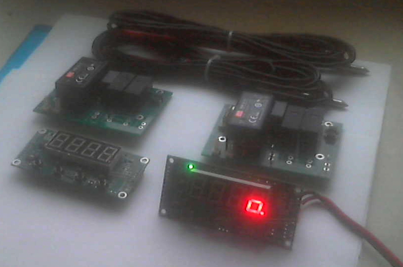 
Assembled Board

---

  

## KVM Device ( Own project ) DIY PiKVM: Remote PC Control via 100M Ethernet (HDMI In/Out)

| Property           | Value                       |
|--------------------|-----------------------------|
| Started on         | Apr 2015                    |
| Author             | Viktor Glebov (V01G04A81)   |

 

&bull; STM32 + ETH PHY + XC6SLX100T + SDRAM 166 Mhz + x2 HDMI  
&bull; Status: Pending.  
&bull; Finding: A reliable solution requires a more complex enterprise-grade system rather than the "simple fix" originally envisioned.  

 

  <a href="pics_kvm/kvm1.png">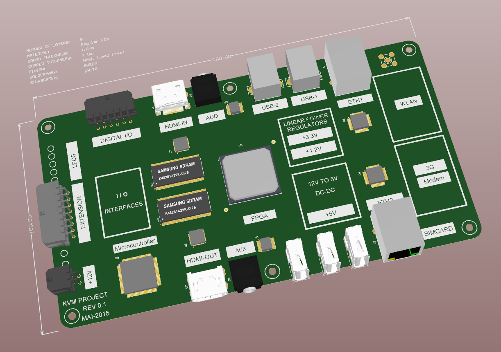</a> 
  <em>KVM Board ( only draft version available from archive ) : Year: 2014-2015 </em>

  

---

  

## OBD-II Multi-Protocol Diagnostic Scanner (i.MX23-based)

| Property           | Value                       |
|--------------------|-----------------------------|
| Started on         | Sep 2015                    |
| Gerbers Completed  | Dec 2015                    |
| Author             | Viktor Glebov (V01G04A81)   |

### System Architecture

**Core:**
  * **MCIMX233CAG4C** processor 
  * **AS4C32M16D1A-5TIN** (DDR1 SDRAM)
  * **T29F4G08ABADAWP:D** (NAND Flash).

**Connectivity & Peripherals:**
  * **STN1110:** Multiprotocol OBD-to-UART interpreter.
  * **ESP8266:** Wi-Fi module for wireless data streaming.
  * **LIS302DLTR:** 3-axis MEMS accelerometer.
  * **Storage:** microSD card slot for data logging.

 ### Key Responsibilities & Features
* **Protocol Support:** Designed and implemented an automotive diagnostic interface supporting **CAN (ISO 15765)**, **K-Line (ISO 9141 / KWP2000)**, and legacy protocols via external transceivers.
* **Firmware Development:** Developed embedded firmware for real-time ECU communication, DTC (Diagnostic Trouble Codes) decoding, and PID data acquisition.
* **Hardware Engineering:** Designed the complete hardware architecture, including automotive-grade power conditioning, transient/surge protection circuits, and high-speed MCU–peripheral interfaces (UART, SPI, EMI).

 

<b>Main Board with OBD Connector, STN1110, LIS302DLTR, and ESP8266 Wi-Fi</b>

  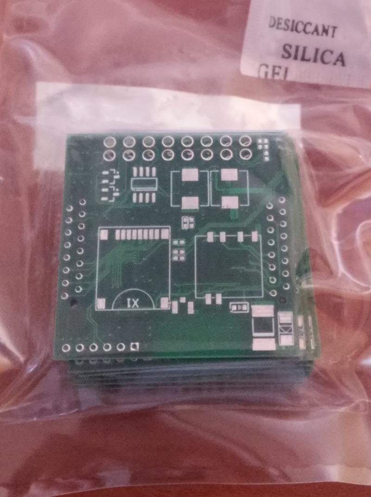

<b>Base Board (3D Models)</b>

  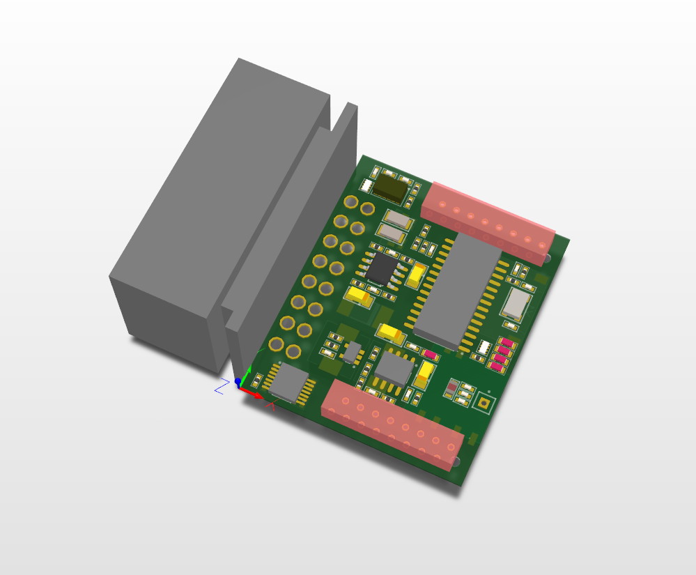
  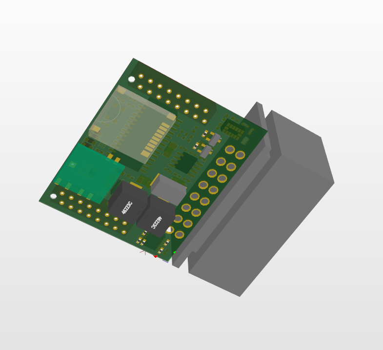
   
  Base board

 

<b>i.MX233 MCU Plug (PCB Prototype Photos)</b>

  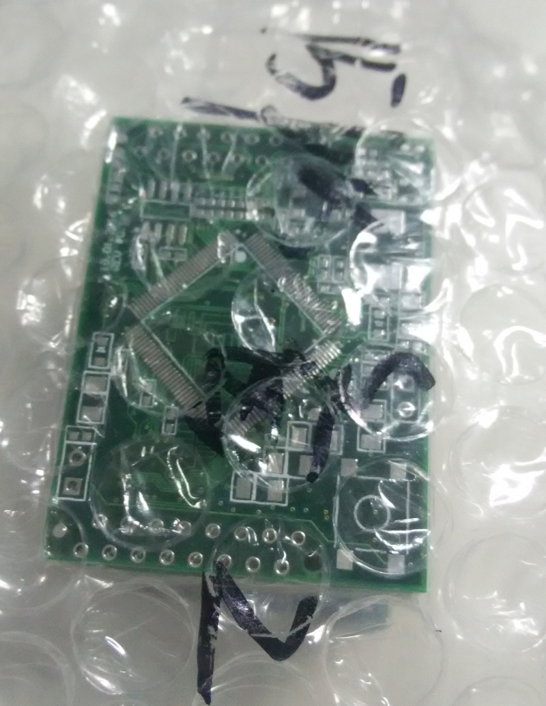
  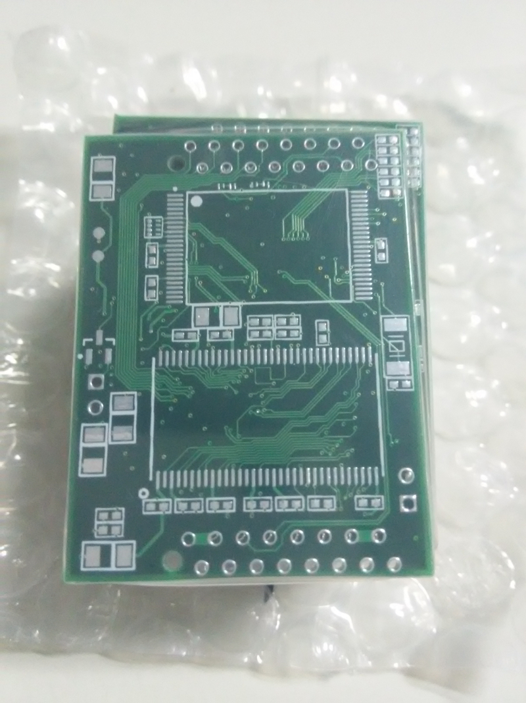
   
  iMX232 Plug

<b>i.MX233 MCU Plug (3D Models)</b>

  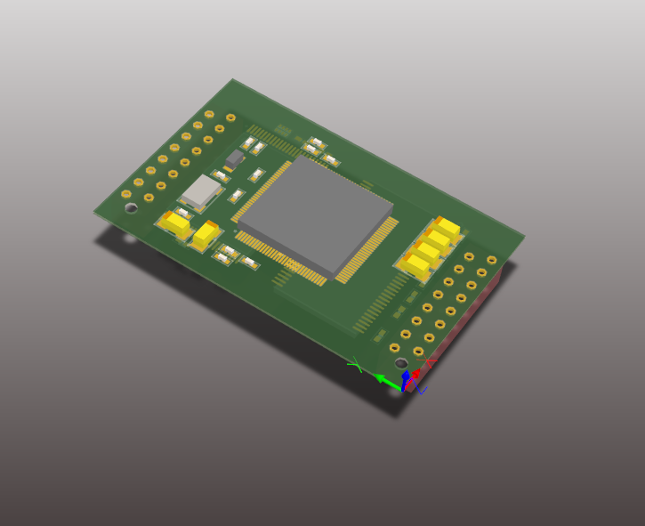
  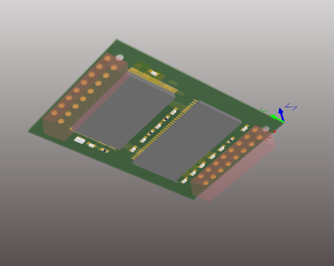
 

---

## Kawasaki OBD-II Diagnostic Device

Compact STM32F407-based motorcycle diagnostic device designed for Kawasaki OBD-II systems with K-Line, KWP2000 and CAN bus support.  

 

#### Project Timeline

| Milestone | Description | Date |
|------------|-------------|------|
| Project Started | Architecture & schematic design | Mar 2016 |
| PCB Layout Completed | Manufacturing process started | Apr 2016 |
| PCB Assembly | First 2 prototypes assembled | May 2016 |
| Firmware Testing | Beta firmware released | Jun 2016 |
| Diagnostic Testing | OBD diagnostics and fault code tests | Jul 2016 |

#### Contributors

| Area | Contributor |
|------|-------------|
| Hardware Architecture | Viktor Glebov (`V01G04A81`) |
| PCB Layout | Viktor Glebov (`V01G04A81`) |
| Firmware Development | Viktor Glebov (`V01G04A81`) |
| Motorcycle Integration | GMad |
| Diagnostic Testing | GMad |

 

### Features

- STM32F407 microcontroller platform
- SPI TFT display support
- 4 user navigation buttons
- External I/O expansion
- SD card support for data logging and diagnostic databases
- USB Host mode for direct data logging to USB flash storage
- USB Device mode for PC synchronization and data exchange
- K-Line / KWP2000 support
    * ISO-14230
    * ISO-9141
- CAN bus interface

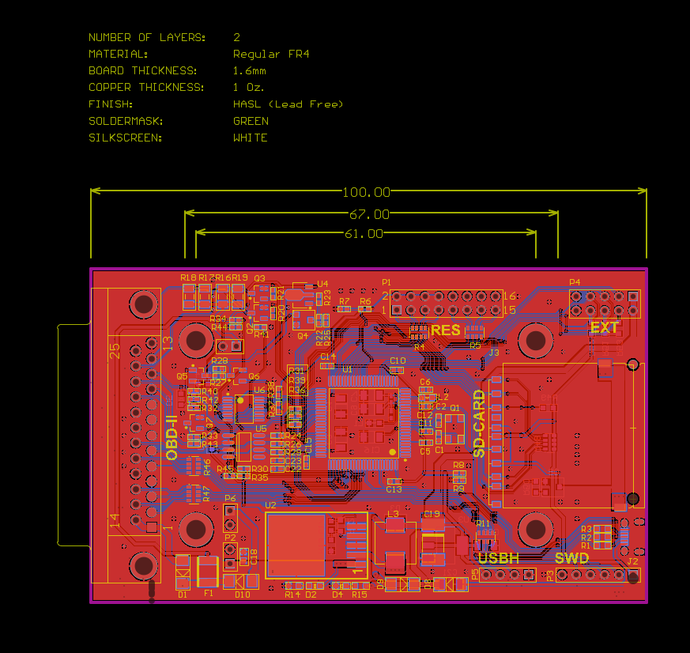 
PCB Layout / Gerber Viewer

    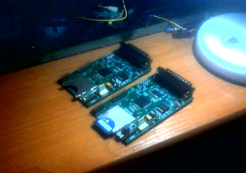
    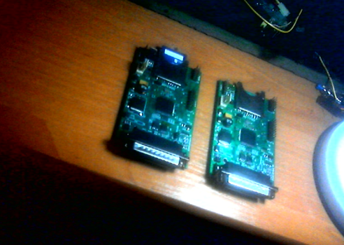
     
    Assembled devices

    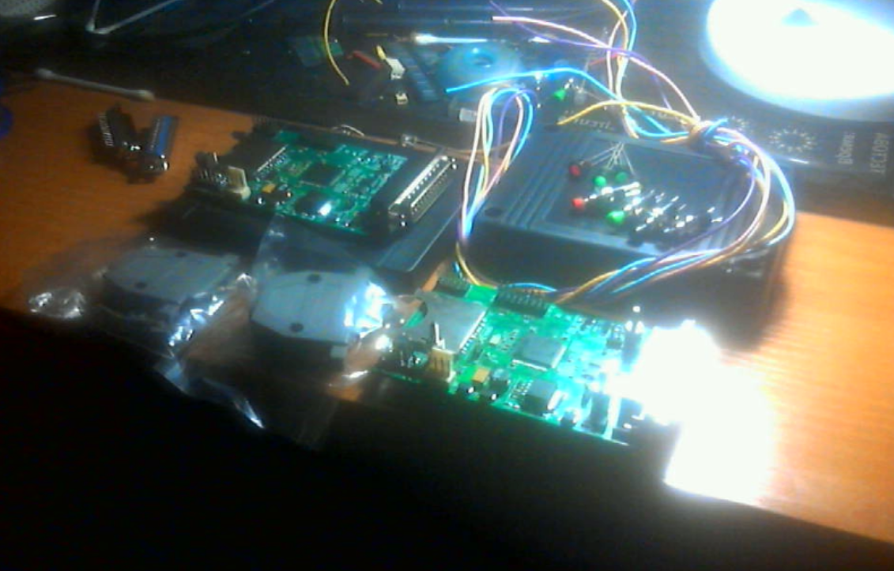
    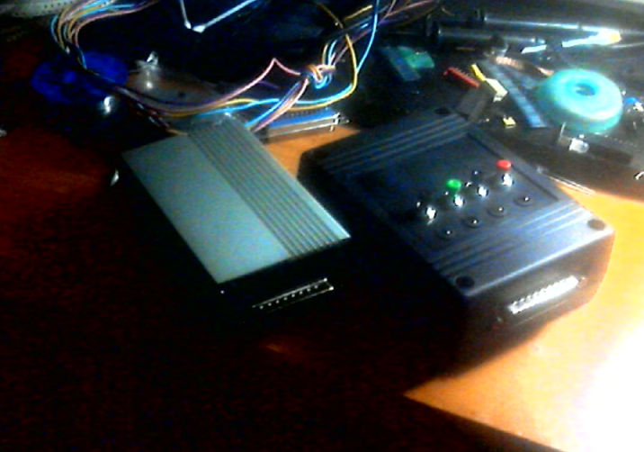
     
    Diagnostic testing

---
2013-2016 V01G04A81
