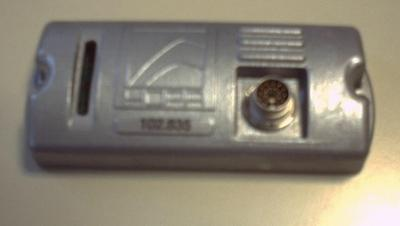
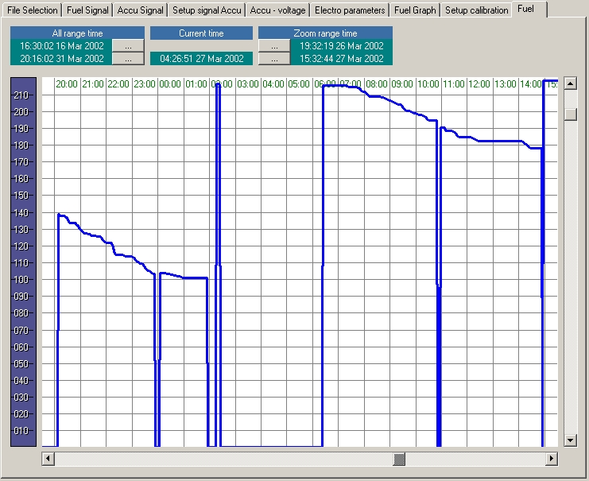

# Experimental Projects

| Property          | Value                       |
|-------------------|-----------------------------|
| Author            | Viktor Glebov (V01G04A81)   |
| Company           | HOPA Motortuning            |
| Date              | 2001 - 2002                 |

---

## AVR Programmer

**Borland C++ Builder 5.0 application**

A programmer tool for AVR microcontrollers via the LPT port, using WinIo v1.3 for direct hardware access under Windows.

**Key features:**
- Direct LPT port communication
- Low-level hardware access via WinIo
- Designed for early AVR device programming workflows

**Source code:** <a href="https://github.com/vigatron/vigatron.github.io/tree/main/projects/hopa2000/AVR_PROGRAMMER">AVR_Pogrammer</a>

 

---

## Application for system configuration, Import & Export data from trucks

 

<table >
  <tr>
    <td>
      
    </td>
    <td>
      

        <strong>Development environment:</strong> CodeWarrior C / IDE
         
        <strong>Requirements:</strong> PalmOS 4.5
      

      

        The Palm device serial port is used to download binary data sets. 
        Multichannel ADC records logs from the device (installed on trucks) with: 
        - temperature log 
        - fuel consumption statistic 
        - and GPS data tags 
      

    </td>
    <td>
      <a href="FFBox.jpg">
    </td>
  </tr>
</table>

**Source code:** <a href="https://github.com/vigatron/vigatron.github.io/tree/main/projects/hopa2000/FFImportExport">FFImportExport app for PalmOS</a>

  

---

## Fuel Monitoring Software

**Borland C++ Builder 5.0 application**

A desktop application for visualization and analysis of truck fuel consumption data.

**Sample screens:**

<table>
  <tr>
    <td align="center">
       
      <em>Fuel consumption graph (truck data) (uncalibrated)</em>
    </td>
    <td align="center">
       
      <em>Fuel consumption graph (zoom view) (uncalibrated)</em>
    </td>
  </tr>
</table>

 

---

2000-2022 Viktor Glebov V01G04A81

